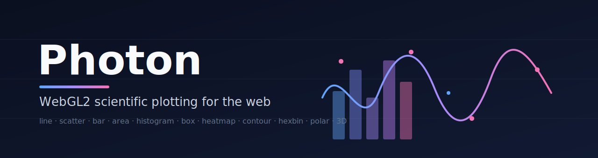
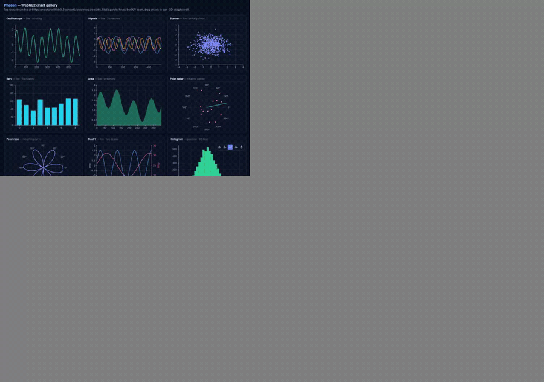
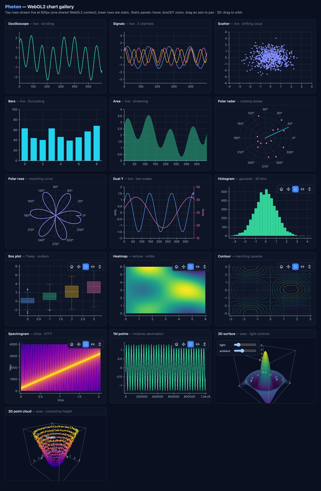

<p align="center">
  
</p>

<p align="center">
  <b>GPU-accelerated scientific plotting for the web.</b><br/>
  One framework-agnostic core · thin React, Vue &amp; Svelte bindings · millions of points at 60fps.
</p>

<p align="center">
  <a href="https://github.com/coredumpdev/photon/actions/workflows/ci.yml"></a>
  
  
  
  
  
</p>

<p align="center">
  
</p>

> **Try it:** `pnpm install && pnpm example` opens the live gallery below — the top
> rows stream at 60fps, the lower rows show histograms, box/violin, heatmaps,
> contours, a 1M-point line, polar plots, and interactive 3D.

---

## Why Photon?

Most web charting libraries render with SVG or Canvas2D and choke past a few
thousand points. Photon renders **geometry on the GPU** and draws the axes,
ticks, and labels on a crisp Canvas2D overlay — so you get both **scale** and
**sharp text**.

- ⚡ **Fast** — instanced WebGL2 rendering + min/max decimation; millions of points stay interactive.
- 🔬 **Scientific** — log & time scales, custom ticks, multiple Y axes, error-free float precision for timestamps.
- 🧩 **Framework-agnostic** — a zero-dependency core with idiomatic React / Vue / Svelte wrappers.
- 📈 **Batteries included** — line, scatter, bar, area, step, histogram, box, violin, heatmap, contour, hexbin, spectrogram, polar, and **3D**.
- 🌊 **Streaming-ready** — `setData()` re-uploads GPU buffers for real-time dashboards.
- 🖼️ **Many charts, one context** — a single shared WebGL2 context backs every chart, so a page can hold dozens without exhausting the browser's context limit.

## Gallery

<p align="center">
  
</p>

<sub>Every panel above is a live capture from <code>pnpm example</code>. Top rows stream in real time; 3D panels have axis ticks and light controls.</sub>

## Install

```bash
npm i @photonviz/core
# framework bindings (optional)
npm i @photonviz/react     # or @photonviz/vue, @photonviz/svelte
```

## Quick start (vanilla core)

```ts
import { Plot } from "@photonviz/core";

const plot = new Plot(document.getElementById("chart")!, {
  theme: "dark",
  scales: { y: { type: "log" } },
});

plot.addLine({ x: xs, y: ys, color: "#60a5fa", width: 2, name: "signal" });
// wheel to zoom · drag to pan · box-zoom + home from the toolbar · hover for tooltips
```

## Framework bindings

<details open><summary><b>React</b> — <code>@photonviz/react</code></summary>

```tsx
import { Plot, Line, Scatter, YAxis } from "@photonviz/react";

export function Chart({ x, y }: { x: Float64Array; y: Float64Array }) {
  return (
    <div style={{ height: 320 }}>
      <Plot options={{ theme: "dark" }}>
        <YAxis id="power" side="right" color="#f472b6" />
        <Line x={x} y={y} color="#60a5fa" width={2} name="signal" />
        <Scatter x={x} y={y} size={4} yAxis="power" />
      </Plot>
    </div>
  );
}
// Pass new x/y arrays to stream — layers update via setData under the hood.
```
</details>

<details><summary><b>Vue</b> — <code>@photonviz/vue</code></summary>

```vue
<script setup lang="ts">
import { Plot, Line, YAxis } from "@photonviz/vue";
defineProps<{ x: Float64Array; y: Float64Array }>();
</script>

<template>
  <div style="height: 320px">
    <Plot :options="{ theme: 'dark' }">
      <YAxis id="power" side="right" color="#f472b6" />
      <Line :x="x" :y="y" color="#60a5fa" :width="2" name="signal" />
    </Plot>
  </div>
</template>
```
</details>

<details><summary><b>Svelte</b> — <code>@photonviz/svelte</code></summary>

```svelte
<script lang="ts">
  import { plot } from "@photonviz/svelte";
  export let x: Float64Array;
  export let y: Float64Array;
  $: config = { options: { theme: "dark" }, series: [{ type: "line", x, y, color: "#60a5fa" }] };
</script>

<div style="height: 320px" use:plot={config}></div>
<!-- reassigning `config` streams new data through setData -->
```
</details>

## Chart types

| Type | API | Notes |
| --- | --- | --- |
| Line | `plot.addLine({ x, y, color, width })` | Real thick lines + round joins/caps (GPU) |
| Step | `plot.addLine({ …, step: "before" \| "after" \| "center" })` | Line variant |
| Scatter | `plot.addScatter({ x, y, size, colorBy })` | Instanced; `colorBy` maps a colormap |
| Bar | `plot.addBar({ x, y, width, offset, base })` | `offset` → grouped, `base` → stacked |
| Area | `plot.addArea({ x, y, base })` | `base` → stacked |
| Histogram | `plot.addHistogram(values, { bins })` | CPU binning → bars |
| Box | `plot.addBox({ groups })` | Tukey quartiles, whiskers, outliers |
| Violin | `plot.addBox({ groups, violin: true, box: false })` | Gaussian KDE |
| Heatmap | `plot.addHeatmap({ values, cols, rows, extent, colormap })` | Texture-backed |
| Contour | `plot.addContour({ values, cols, rows, extent, levels })` | Marching squares |
| Hexbin | `plot.addHexbin({ x, y, radius, colormap })` | Density aggregation |
| Spectrogram | `plot.addHeatmapSpectrogram(signal, { fftSize, hop, sampleRate })` | STFT → heatmap |

Colormaps: `viridis`, `plasma`, `coolwarm`, `grayscale`.

### Polar — `PolarPlot`

```ts
import { PolarPlot } from "@photonviz/core";
const p = new PolarPlot(el, { angleUnit: "deg" });
p.addLine({ theta, r, color: "#a78bfa", closed: true });
p.addScatter({ theta, r, size: 6 });
```

### 3D — `Plot3D` (orbit camera)

```ts
import { Plot3D } from "@photonviz/core";
const p = new Plot3D(el);
p.addSurface({ values, cols, rows, extentX, extentZ, colormap });  // z = f(x, y)
p.addPointCloud({ x, y, z, size, colorBy });                       // 3D scatter
// drag to orbit · wheel to zoom · data auto-normalized into a unit cube
```

## Custom ticks

Scientific axes want *meaningful* positions, not "auto-pretty" ones:

```ts
plot.setAxis("x", {
  ticks: [
    { value: 0, label: "0" },
    { value: Math.PI, label: "π" },
    { value: 2 * Math.PI, label: "2π" },
  ],
  minorTicks: true,          // auto minors between majors
});
plot.setAxis("y", { addTicks: [{ value: 42, label: "threshold" }] }); // overlay on auto ticks
```

## Scales & interaction

- **Scales** — `linear`, `log` (decade ticks + minors, GPU log transform), `time` (calendar ticks; large epoch timestamps handled with per-layer reference offsets).
- **Toolbar** — home + pan / box-zoom / X-only / Y-only zoom.
- **Box zoom** maps the selection rectangle exactly onto the axes; **drag an axis strip** to pan just that axis; **hover** for crosshair + per-series tooltips.

## Streaming

Every chart shares one WebGL2 context (blitted into each chart's own canvas), so
a page can hold **many** live charts. Line/scatter/bar/area expose `setData`:

```ts
const line = plot.addLine({ x, y });
function frame() {
  y.copyWithin(0, 1); y[y.length - 1] = nextSample();  // scroll
  line.setData(x, y);
  plot.render();
  requestAnimationFrame(frame);
}
```

## Packages

| Package | Description |
| --- | --- |
| [`@photonviz/core`](./packages/core) | WebGL2 rendering core, zero dependencies |
| [`@photonviz/react`](./packages/react) | React components + `usePlot` hook |
| [`@photonviz/vue`](./packages/vue) | Vue components (provide/inject) |
| [`@photonviz/svelte`](./packages/svelte) | Svelte `use:plot` action |

## Development

```bash
pnpm install
pnpm test        # unit tests (vitest)
pnpm typecheck   # strict tsc across packages
pnpm build       # build all packages (tsup)
pnpm example     # live gallery (vite)
```

## Contributing

Contributions are very welcome — see [CONTRIBUTING.md](./CONTRIBUTING.md) for the
dev setup, how to add a new layer type, and the PR checklist. Good first issues
are labeled [`good first issue`](https://github.com/coredumpdev/photon/labels/good%20first%20issue).

## Roadmap

- [x] 2D core, thick lines, log/time scales, hover/tooltip, multiple Y axes
- [x] Statistical (histogram, box/violin, heatmap), contour, hexbin, spectrogram
- [x] 3D (surface, point cloud), polar, streaming, shared context
- [x] React / Vue / Svelte bindings
- [x] 3D axes/ticks & lighting controls
- [ ] Line joins tuning, GPU-side decimation
- [ ] WebGPU backend exploration

## License

[MIT](./LICENSE) © Photon contributors
