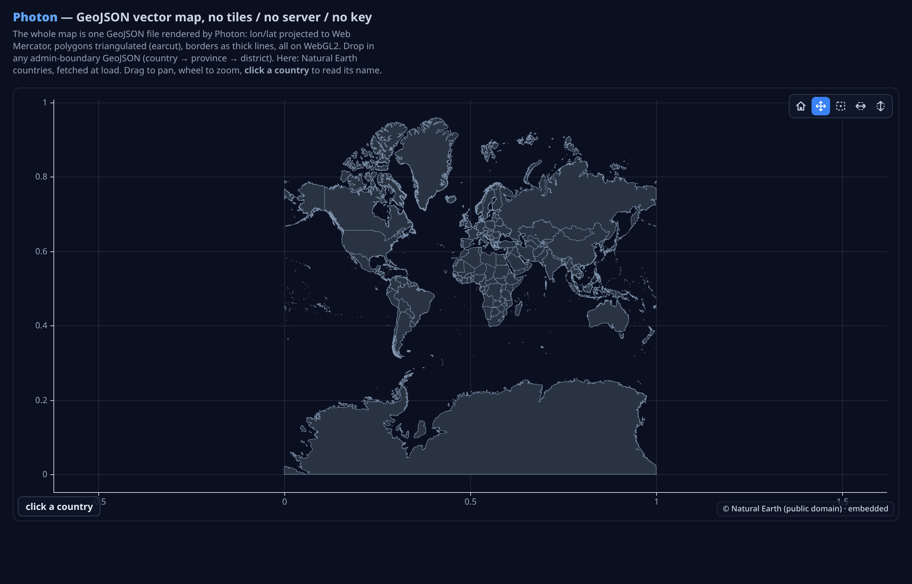

<p align="center">
  
</p>

<p align="center">
  <b>GPU-accelerated scientific plotting for the web.</b><br/>
  One framework-agnostic core · React, Vue, Svelte, Solid &amp; Gea bindings · millions of points at 60fps.
</p>

<p align="center">
  <a href="https://github.com/coredumpdev/photon/actions/workflows/ci.yml"></a>
  
  
  
  
  
</p>

<p align="center">
  
</p>

> **Try it:** `pnpm install && pnpm example` opens the live gallery below — the top
> rows stream at 60fps, the lower rows show histograms, box/violin, heatmaps,
> contours, a 1M-point line, polar plots, and interactive 3D.

---

## Why Photon?

Most web charting libraries render with SVG or Canvas2D and choke past a few
thousand points. Photon renders **geometry on the GPU** and draws the axes,
ticks, and labels on a crisp Canvas2D overlay — so you get both **scale** and
**sharp text**.

- ⚡ **Fast** — instanced WebGL2 rendering + min/max decimation (GPU above 200k pts); millions of points stay interactive. LUT-backed colormaps, benchmarked (`pnpm bench`).
- 🔬 **Scientific** — linear/log/time **and categorical** scales, custom ticks, multiple Y axes, error-free float precision for timestamps.
- 📈 **Batteries included** — line, step, scatter (marker glyphs), bar (grouped/stacked/horizontal), area (+ stacked), histogram, box, violin, heatmap, contour, hexbin, spectrogram, **pie/donut**, **patches/polygons**, **graph/network**, **image**, **annotations** (span/band/box/label), polar, and a full **3D** suite.
- 🎨 **Fully styleable** — Bokeh-like flat props: `background`, `title`, `legend`, and per-axis line/tick/label/grid color, font & label rotation.
- 🧩 **Framework-agnostic** — a zero-dependency core with idiomatic **React, Vue, Svelte, Solid & Gea** wrappers.
- 🧊 **Rich 3D** — surface (+ wireframe), scatter, line, bars, quiver, contour, marching-cubes isosurface, and GPU **volume raymarching** — with legend, colorbar, hover tooltip, grid planes & auto-rotate.
- 🗺️ **Maps** — [`@photonviz/map`](./packages/map) renders a Web Mercator vector basemap **from scratch** (MVT + PMTiles + GeoJSON), works **fully offline**, no Mapbox / MapLibre / Leaflet.
- 🌊 **Streaming-ready** — `setData()` re-uploads GPU buffers for real-time dashboards.
- 🖼️ **Many charts, one context** — a single shared WebGL2 context backs every chart, so a page can hold dozens without exhausting the browser's context limit.

## Gallery

<p align="center">
  
</p>

<sub>Every panel above is a live capture from <code>pnpm example</code>. Top rows stream in real time; 3D panels have axis ticks and light controls.</sub>

## Install

```bash
npm i @photonviz/core
# framework bindings (optional)
npm i @photonviz/react     # or @photonviz/vue, @photonviz/svelte, @photonviz/solid, @photonviz/gea
# vector maps (optional)
npm i @photonviz/map
```

## Quick start (vanilla core)

```ts
import { Plot } from "@photonviz/core";

const plot = new Plot(document.getElementById("chart")!, {
  theme: "dark",
  scales: { y: { type: "log" } },
});

plot.addLine({ x: xs, y: ys, color: "#60a5fa", width: 2, name: "signal" });
// wheel to zoom · drag to pan · box-zoom + home from the toolbar · hover for tooltips
```

## Framework bindings

<details open><summary><b>React</b> — <code>@photonviz/react</code></summary>

```tsx
import { Plot, Line, Scatter, YAxis } from "@photonviz/react";

export function Chart({ x, y }: { x: Float64Array; y: Float64Array }) {
  return (
    <div style={{ height: 320 }}>
      <Plot options={{ theme: "dark" }}>
        <YAxis id="power" side="right" color="#f472b6" />
        <Line x={x} y={y} color="#60a5fa" width={2} name="signal" />
        <Scatter x={x} y={y} size={4} yAxis="power" />
      </Plot>
    </div>
  );
}
// Pass new x/y arrays to stream — layers update via setData under the hood.
```
</details>

<details><summary><b>Vue</b> — <code>@photonviz/vue</code></summary>

```vue
<script setup lang="ts">
import { Plot, Line, YAxis } from "@photonviz/vue";
defineProps<{ x: Float64Array; y: Float64Array }>();
</script>

<template>
  <div style="height: 320px">
    <Plot :options="{ theme: 'dark' }">
      <YAxis id="power" side="right" color="#f472b6" />
      <Line :x="x" :y="y" color="#60a5fa" :width="2" name="signal" />
    </Plot>
  </div>
</template>
```
</details>

<details><summary><b>Svelte</b> — <code>@photonviz/svelte</code></summary>

```svelte
<script lang="ts">
  import { plot } from "@photonviz/svelte";
  export let x: Float64Array;
  export let y: Float64Array;
  $: config = { options: { theme: "dark" }, series: [{ type: "line", x, y, color: "#60a5fa" }] };
</script>

<div style="height: 320px" use:plot={config}></div>
<!-- reassigning `config` streams new data through setData -->
```
</details>

<details><summary><b>Solid</b> — <code>@photonviz/solid</code></summary>

```tsx
import { Plot, Line, Scatter } from "@photonviz/solid";

export function Chart(props: { x: Float64Array; y: () => Float64Array }) {
  return (
    <div style={{ height: "320px" }}>
      <Plot options={{ theme: "dark" }}>
        <Line x={props.x} y={props.y()} color="#60a5fa" width={2} name="signal" />
        <Scatter x={props.x} y={props.y()} size={4} marker="diamond" />
      </Plot>
    </div>
  );
}
// Pass a signal to a data prop to stream — the layer re-uploads via setData.
```
</details>

<details><summary><b>Gea</b> — <code>@photonviz/gea</code></summary>

```tsx
import { Component } from "@geajs/core";
import { Plot } from "@photonviz/gea";

export default class Chart extends Component {
  template() {
    return (
      <div style="height:320px">
        <Plot options={{ theme: "dark" }} series={[{ type: "line", x: this.props.x, y: this.props.y, color: "#60a5fa" }]} />
      </div>
    );
  }
}
// Config-driven (Gea has no context API); stream via the onReady handle.
```
</details>

## Chart types

| Type | API | Notes |
| --- | --- | --- |
| Line | `plot.addLine({ x, y, color, width })` | Real thick lines + round/miter/bevel joins (GPU) |
| Step | `plot.addLine({ …, step: "before" \| "after" \| "center" })` | Line variant |
| Scatter | `plot.addScatter({ x, y, size, marker, colorBy })` | Instanced; `marker`: circle/square/triangle/diamond/cross/plus |
| Bar | `plot.addBar({ x, y, width, offset, base, orientation })` | `orientation:"h"` → horizontal |
| Grouped / stacked bars | `plot.addGroupedBars({ x, series })` · `plot.addStackedBars(...)` | Categorical clusters / stacks |
| Area / stacked | `plot.addArea({ x, y, base })` · `plot.addStackedArea({ x, series })` | Cumulative bands |
| Histogram | `plot.addHistogram(values, { bins })` | CPU binning → bars |
| Box / Violin | `plot.addBox({ groups, violin? })` | Tukey quartiles + whiskers / Gaussian KDE |
| Heatmap / Image | `plot.addHeatmap({ values, cols, rows, extent })` · `plot.addImage({ source, extent })` | Texture-backed; RGBA / URL |
| Contour | `plot.addContour({ values, cols, rows, extent, levels })` | Marching squares |
| Hexbin | `plot.addHexbin({ x, y, radius, colormap })` | Density aggregation |
| Pie / Donut | `plot.addPie({ values, innerRadius?, colormap? })` | Wedges (set `equalAspect`) |
| Patches | `plot.addPatches({ patches, colormap? })` | Filled polygons (earcut), choropleth |
| Graph | `plot.addGraph({ edges, nodes? })` | Node-link; auto force layout |
| Annotations | `plot.addAnnotation({ type: "span" \| "band" \| "box" \| "label", … })` | Canvas2D overlay |
| Spectrogram | `plot.addHeatmapSpectrogram(signal, { fftSize, hop, sampleRate })` | STFT → heatmap |

Colormaps: `viridis`, `plasma`, `coolwarm`, `grayscale`.

### Styling & config — Bokeh-like flat props

```ts
new Plot(el, {
  background: "#0b1220",              // plot-region fill  (+ border for the margins)
  title: { text: "Revenue", align: "left" },
  legend: { position: "top-right" }, // named series with color swatches
  scales: { x: { type: "categorical", factors: ["Jan", "Feb", "Mar"] } },
  axes: { x: { labelRotation: 40, gridColor: "rgba(148,163,184,.1)", gridDash: [3, 3] } },
});
```

### Polar — `PolarPlot`

```ts
import { PolarPlot } from "@photonviz/core";
const p = new PolarPlot(el, { angleUnit: "deg" });
p.addLine({ theta, r, color: "#a78bfa", closed: true });
p.addScatter({ theta, r, size: 6 });
```

### 3D — `Plot3D` (orbit camera)

```ts
import { Plot3D } from "@photonviz/core";
const p = new Plot3D(el, { title: "Field", legend: true, autoRotate: true });
p.addSurface({ values, cols, rows, extentX, extentZ, colormap, wireframe });  // z = f(x, y)
p.addPointCloud({ x, y, z, sizes, labels, colorBy });                          // 3D scatter
p.addBar3D({ x, z, y, colorBy });                                              // 3D bars
p.addLine3D({ x, y, z });  p.addQuiver3D({ x, y, z, u, v, w });                // paths / vectors
p.addContour3D({ values, cols, rows, levels });                                // iso-height rings
p.addIsosurface({ values, dims, isoLevel });                                   // marching cubes
p.addVolume({ values, dims, colormap, density });                             // GPU raymarch
// drag to orbit · wheel to zoom · hover for a point tooltip + ring · ⌂ resets the view
```

3D plots get a colorbar (colormapped layers), legend, canvas title, back-wall grid
planes, and optional `autoRotate` — all as flat `Plot3DOptions`.

## Maps — `@photonviz/map`

A Web Mercator vector basemap rendered **from scratch** on the same WebGL2 context
— MVT decoding, ear-clipping triangulation, thick lines with miter joins, tile
math and rendering are all in this package. No Mapbox / MapLibre / Leaflet.

<p align="center">
  
</p>

```ts
import { Plot } from "@photonviz/core";
import { addMap, pmtilesSource, protomapsStyle, lonLatToWorld } from "@photonviz/map";

const plot = new Plot(el, { equalAspect: true, boundedPan: true }); // plots in world coords
const map = addMap(plot, {
  source: pmtilesSource({ blob: file }),   // a local .pmtiles file → fully offline
  style: protomapsStyle("dark"),
});

// overlay your own data (project lon/lat → world), and pick features on click
plot.addScatter({ x: [lonLatToWorld(28.98, 41.01)[0]], y: [lonLatToWorld(28.98, 41.01)[1]] });
const hit = map.pickFeature(worldX, worldY);   // { layer, properties } | null
```

- **Tile sources** — any XYZ `.pbf` endpoint (`xyzVectorSource`) or a single
  **PMTiles** archive from a URL, a local **`File`/`Blob`** (offline), or in-memory
  `data` (`pmtilesSource`). The whole planet lives in one range-served file.
- **GeoJSON** — `addGeoJson(plot, { geojson })` renders a whole map from one file
  (admin boundaries, etc.) — no tiles, no server, no key.
- **Batteries-included world** — `import { worldCountries } from "@photonviz/map/world"`
  ships a Natural Earth 10m basemap **embedded in the library** (opt-in subpath, so
  the main entry stays tiny).
- **Offline** — the local-file path reads byte ranges via `Blob.slice()`; bundle a
  region `.pmtiles` for a fully offline desktop/mobile map.
- **Interactive** — `equalAspect` (no distortion), `boundedPan`, feature picking,
  thick roads/borders, styled by tile-layer + properties.

Wrapped for every framework too: `<Map>` / `<GeoJson>` (React, Vue, Solid) and
`{ type: "map" }` / `{ type: "geojson" }` series (Svelte, Gea).

## Custom ticks

Scientific axes want *meaningful* positions, not "auto-pretty" ones:

```ts
plot.setAxis("x", {
  ticks: [
    { value: 0, label: "0" },
    { value: Math.PI, label: "π" },
    { value: 2 * Math.PI, label: "2π" },
  ],
  minorTicks: true,          // auto minors between majors
});
plot.setAxis("y", { addTicks: [{ value: 42, label: "threshold" }] }); // overlay on auto ticks
```

## Scales & interaction

- **Scales** — `linear`, `log` (decade ticks + minors, GPU log transform), `time` (calendar ticks; large epoch timestamps handled with per-layer reference offsets).
- **Toolbar** — home + pan / box-zoom / X-only / Y-only zoom.
- **Box zoom** maps the selection rectangle exactly onto the axes; **drag an axis strip** to pan just that axis; **hover** for crosshair + per-series tooltips.

## Streaming

Every chart shares one WebGL2 context (blitted into each chart's own canvas), so
a page can hold **many** live charts. Line/scatter/bar/area expose `setData`:

```ts
const line = plot.addLine({ x, y });
function frame() {
  y.copyWithin(0, 1); y[y.length - 1] = nextSample();  // scroll
  line.setData(x, y);
  plot.render();
  requestAnimationFrame(frame);
}
```

## Packages

| Package | Description |
| --- | --- |
| [`@photonviz/core`](./packages/core) | WebGL2 rendering core, zero dependencies |
| [`@photonviz/map`](./packages/map) | Web Mercator vector basemap (MVT / PMTiles / GeoJSON), zero dependencies |
| [`@photonviz/react`](./packages/react) | React components + `usePlot` hook |
| [`@photonviz/vue`](./packages/vue) | Vue components (provide/inject) |
| [`@photonviz/svelte`](./packages/svelte) | Svelte `use:plot` action |
| [`@photonviz/solid`](./packages/solid) | Solid.js components (JSX-free source) |
| [`@photonviz/gea`](./packages/gea) | [Gea](https://github.com/dashersw/gea) components (config-driven) |

Every chart type, `PolarPlot`, `Plot3D`, and the map layers are wrapped in all
five frameworks. Runnable examples: [`examples/react`](./examples/react),
[`examples/vue`](./examples/vue), [`examples/svelte`](./examples/svelte),
[`examples/solid`](./examples/solid), [`examples/gea`](./examples/gea).

## Development

```bash
pnpm install
pnpm test        # unit tests (vitest)
pnpm bench       # micro-benchmarks of the pure hot paths (vitest bench)
pnpm typecheck   # strict tsc across packages
pnpm build       # build all packages (tsup)
pnpm example     # live gallery (vite)
pnpm example:react   # React example  (also :vue, :svelte, :solid, :gea)
```

The vanilla gallery also has dedicated pages: `/map.html` (vector tiles),
`/geojson.html` (GeoJSON world), and `/pmtiles-offline.html` (pick a local
`.pmtiles` → fully offline map).

## Contributing

Contributions are very welcome — see [CONTRIBUTING.md](./CONTRIBUTING.md) for the
dev setup, how to add a new layer type, and the PR checklist. Good first issues
are labeled [`good first issue`](https://github.com/coredumpdev/photon/labels/good%20first%20issue).

## Roadmap

- [x] 2D core, thick lines, log/time/**categorical** scales, hover/tooltip, multiple Y axes
- [x] Full styling/config — background, title, **legend**, per-axis line/tick/label/grid styling
- [x] Statistical (histogram, box/violin, heatmap), contour, hexbin, spectrogram
- [x] Pie/donut, patches/polygons, graph/network, image, annotations (span/band/box/label)
- [x] Bars — grouped / stacked / horizontal; stacked area; scatter marker glyphs
- [x] 3D suite — surface (+wireframe), scatter, line, bars, quiver, contour, isosurface, **volume raymarch**
- [x] 3D chrome — legend, colorbar, title, hover tooltip+ring, grid planes, reset, auto-rotate
- [x] React / Vue / Svelte / **Solid** / **Gea** bindings (every chart type, polar, 3D, and maps)
- [x] Line joins tuning (miter/bevel/round + miter limit), GPU-side decimation, LUT colormaps
- [x] Vector maps — `@photonviz/map` (MVT + PMTiles + GeoJSON, offline, feature picking)
- [ ] Map text labels (glyph atlas + collision)
- [ ] WebGPU backend exploration

## License

[MIT](./LICENSE) © Photon contributors
